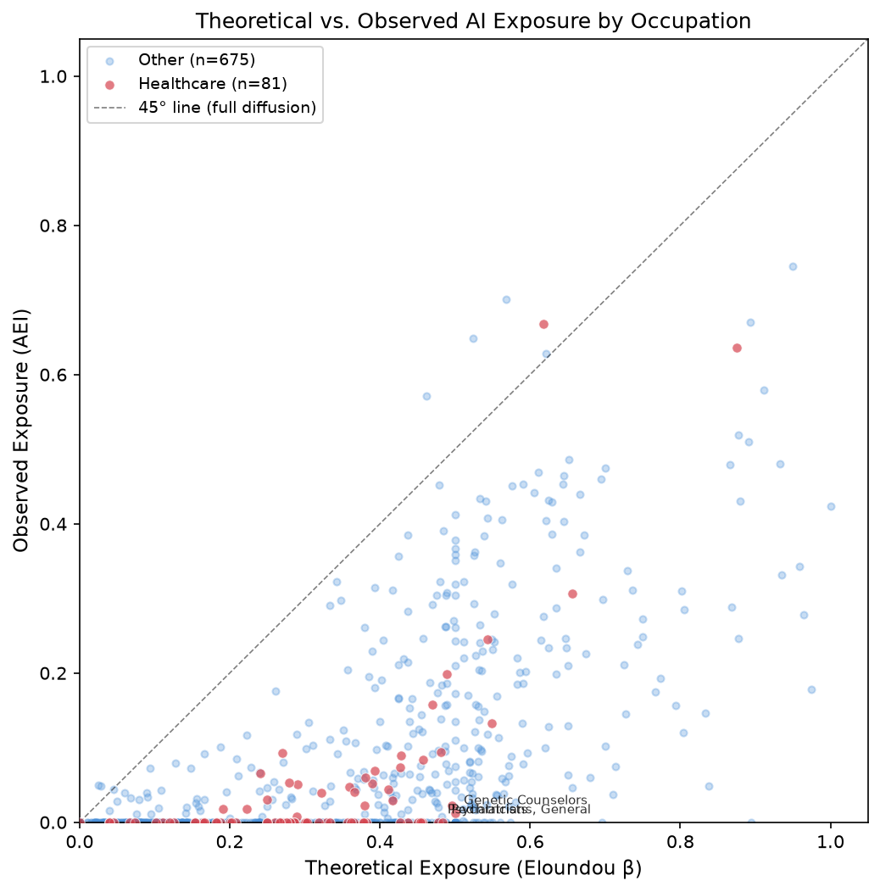
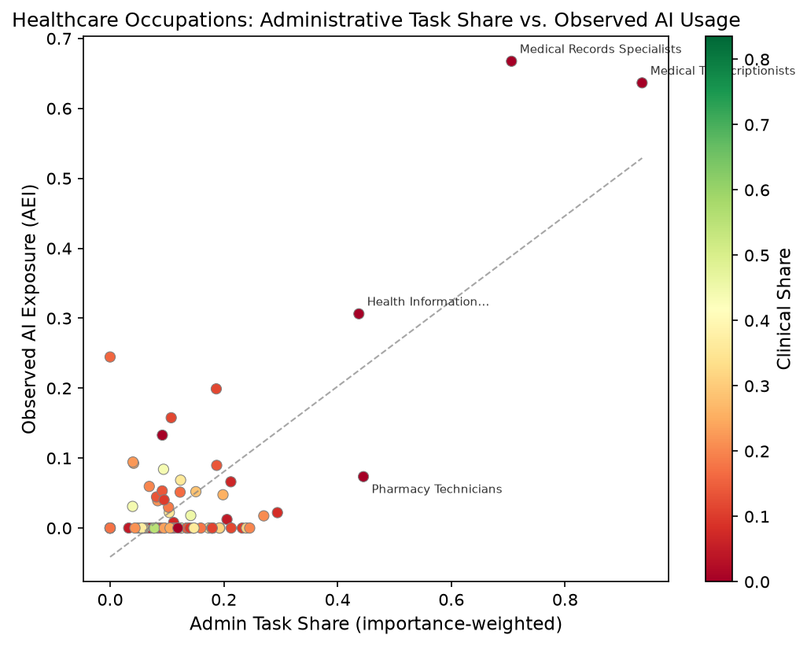

# AI Labor Impact Observatory

**Across U.S. occupations — and the health-sector workforce in particular — how does *theoretical* LLM exposure compare to *observed* AI usage, and which tasks are being complemented vs. substituted?**

This project measures the gap between what LLMs *could* automate (theoretical exposure, from Eloundou et al.) and what they *actually* do (observed usage, from the Anthropic Economic Index), with a focus on healthcare occupations (SOC major groups 29 and 31). Within healthcare, it decomposes exposure by task type — administrative vs. clinical — to test whether AI adoption concentrates on the documentation/scheduling/coding layer while clinical judgment tasks remain human-performed.

## Key finding

Within healthcare, **AI usage concentrates on administrative tasks, not clinical ones.** The correlation between an occupation's administrative task share and its observed AI exposure is 0.76. Admin-heavy healthcare occupations (medical transcriptionists, medical records specialists) show observed AI usage 5x higher than clinical-heavy ones (surgeons, physical therapists). In regression, a 10pp increase in admin task share associates with 6.2pp higher AI usage (p < 0.001, R-squared = 0.58), while education level is not significant. Meanwhile, healthcare as a whole is *under-adopting* relative to theoretical potential — its diffusion gap (0.27) exceeds the economy-wide average (0.25).


*Most occupations sit well below the 45-degree line. Healthcare (red) clusters low on observed usage despite moderate theoretical exposure.*


*Within healthcare, observed AI usage tracks administrative task share. Medical Records Specialists and Medical Transcriptionists are clear outliers; clinical-heavy occupations cluster near zero.*

## Data sources

| Source | What | License |
|--------|------|---------|
| [O\*NET 30.3](https://www.onetcenter.org/database.html) | Task statements, importance ratings, work activities, SOC crosswalk | CC-BY |
| [BLS OEWS May 2025](https://www.bls.gov/oes/tables.htm) | Occupation-level wages and employment | Public domain |
| [Anthropic Economic Index](https://huggingface.co/datasets/Anthropic/EconomicIndex) | Observed AI usage by occupation and task | CC-BY |
| [Eloundou et al. (2024)](https://doi.org/10.1126/science.adj0998) | Theoretical LLM exposure scores (beta) | Public repo |
| [Felten/Raj/Seamans AIOE](https://doi.org/10.1002/smj.3286) | Alternative exposure measure (robustness) | Public repo |

## Reproducibility

```bash
make setup            # creates venv + installs deps
source .venv/bin/activate
make all              # download -> build -> analyze -> figures
```

`make all` reproduces the entire pipeline — raw data download, dbt staging/intermediate/mart build with 10 data-quality tests, descriptive statistics, regressions, and 6 publication figures. One manual step: BLS OEWS data must be downloaded via browser (BLS blocks automated requests) and saved to `data_raw/oews/national_M2025_dl.xlsx`. The pipeline runs without it but wage/employment columns will be NULL.

## Methodology

Exposure is **potential capability, not realized job loss**. Eloundou et al. and Anthropic both state this explicitly; this project does too, prominently and repeatedly. Cross-sectional exposure scores do not imply causal employment effects.

See `reports/methodology.md` for the full methods documentation, including every judgment call (SOC crosswalk rules, suppressed-cell handling, importance weighting, admin/clinical classification).

## Repo structure

```
data_raw/           # Immutable source pulls (gitignored; manifest in SOURCES.md)
warehouse/dbt/      # dbt-core models: staging -> intermediate -> marts
src/                # Ingest, crosswalk, task classification
analysis/           # Descriptives, regressions, figures
figures/            # Generated plots
reports/            # Policy memo, methodology, data dictionary
```

## Citation

Eloundou, T., Manning, S., Mishkin, P., & Rock, D. (2024). GPTs are GPTs. *Science*, 384, 1306-1308.
Handa, K., et al. (2025). Which Economic Tasks are Performed with AI? arXiv:2503.04761.
Felten, E., Raj, M., & Seamans, R. (2021). Occupational, industry, and geographic exposure to AI. *Strategic Management Journal*, 42(12).

## License

Analysis code: MIT. Data files retain their original licenses (see `data_raw/SOURCES.md`).
